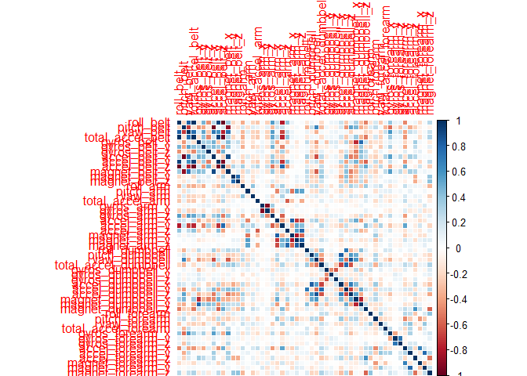
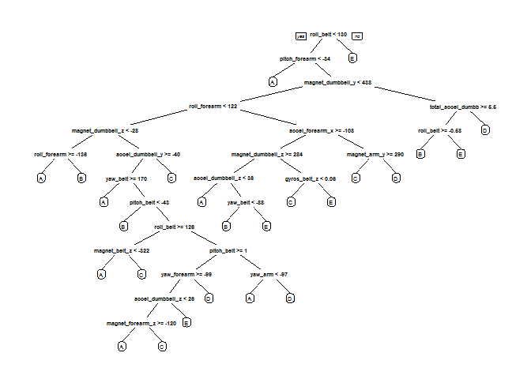

Introduction
------------

It is relatively inexpensive to collect a large amount of data about
personal activity. This is possible because of the personal activity
tracking devices such as Jawbone Up, Nike FuelBand, and Fitbit These
type of devices are part of the quantified self movement - a group of
enthusiasts who take measurements about themselves regularly to improve
their health, to find patterns in their behavior, or because they are
tech geeks. One thing that people regularly do is quantify how much of a
particular activity they do, but they rarely quantify how well they do
it.

In this project, we will use data from accelerometers on the belt,
forearm, arm, and dumbell of 6 participants to predict the manner in
which they did the exercise.

Data Preprocessing
------------------

    library(caret)

    ## Loading required package: lattice

    ## Loading required package: ggplot2

    library(rpart)
    library(rpart.plot)
    library(randomForest)

    ## randomForest 4.6-12

    ## Type rfNews() to see new features/changes/bug fixes.

    ## 
    ## Attaching package: 'randomForest'

    ## The following object is masked from 'package:ggplot2':
    ## 
    ##     margin

    library(corrplot)

### Download the Data

    trainUrl <-"https://d396qusza40orc.cloudfront.net/predmachlearn/pml-training.csv"
    testUrl <- "https://d396qusza40orc.cloudfront.net/predmachlearn/pml-testing.csv"
    trainFile <- "./data/pml-training.csv"
    testFile  <- "./data/pml-testing.csv"
    if (!file.exists("./data")) {
      dir.create("./data")
    }
    if (!file.exists(trainFile)) {
      download.file(trainUrl, destfile=trainFile, method="curl")
    }
    if (!file.exists(testFile)) {
      download.file(testUrl, destfile=testFile, method="curl")
    }

### Read the Data

After downloading the data from the data source, we can read the two csv
files into two data frames.

    trainRaw <- read.csv("./data/pml-training.csv")
    testRaw <- read.csv("./data/pml-testing.csv")
    dim(trainRaw)

    ## [1] 19622   160

    dim(testRaw)

    ## [1]  20 160

The training data set contains 19622 observations and 160 variables,
while the testing data set contains 20 observations and 160 variables.
The "classe" variable in the training set is the outcome to predict.

### Clean the data

In this step, we will clean the data and get rid of observations with
missing values as well as some meaningless variables.

    sum(complete.cases(trainRaw))

    ## [1] 406

First, we remove columns that contain NA missing values.

    trainRaw <- trainRaw[, colSums(is.na(trainRaw)) == 0] 
    testRaw <- testRaw[, colSums(is.na(testRaw)) == 0] 

Next, we get rid of some columns that do not contribute much to the
accelerometer measurements.

    classe <- trainRaw$classe
    trainRemove <- grepl("^X|timestamp|window", names(trainRaw))
    trainRaw <- trainRaw[, !trainRemove]
    trainCleaned <- trainRaw[, sapply(trainRaw, is.numeric)]
    trainCleaned$classe <- classe
    testRemove <- grepl("^X|timestamp|window", names(testRaw))
    testRaw <- testRaw[, !testRemove]
    testCleaned <- testRaw[, sapply(testRaw, is.numeric)]

Now, the cleaned training data set contains 19622 observations and 53
variables, while the testing data set contains 20 observations and 53
variables. The "classe" variable is still in the cleaned training set.

### Slice the data

Then, we can split the cleaned training set into a pure training data
set (70%) and a validation data set (30%). We will use the validation
data set to conduct cross validation in future steps.

    set.seed(22519) # For reproducibile purpose
    inTrain <- createDataPartition(trainCleaned$classe, p=0.70, list=F)
    trainData <- trainCleaned[inTrain, ]
    testData <- trainCleaned[-inTrain, ]

Data Modeling
-------------

We fit a predictive model for activity recognition using **Random
Forest** algorithm because it automatically selects important variables
and is robust to correlated covariates & outliers in general. We will
use **5-fold cross validation** when applying the algorithm.

    controlRf <- trainControl(method="cv", 5)
    modelRf <- train(classe ~ ., data=trainData, method="rf", trControl=controlRf, ntree=250)
    modelRf

    ## Random Forest 
    ## 
    ## 13737 samples
    ##    52 predictor
    ##     5 classes: 'A', 'B', 'C', 'D', 'E' 
    ## 
    ## No pre-processing
    ## Resampling: Cross-Validated (5 fold) 
    ## Summary of sample sizes: 10989, 10989, 10991, 10990, 10989 
    ## Resampling results across tuning parameters:
    ## 
    ##   mtry  Accuracy   Kappa    
    ##    2    0.9901727  0.9875673
    ##   27    0.9917015  0.9895017
    ##   52    0.9840572  0.9798282
    ## 
    ## Accuracy was used to select the optimal model using  the largest value.
    ## The final value used for the model was mtry = 27.

Then, we estimate the performance of the model on the validation data
set.

    predictRf <- predict(modelRf, testData)
    confusionMatrix(testData$classe, predictRf)

    ## Confusion Matrix and Statistics
    ## 
    ##           Reference
    ## Prediction    A    B    C    D    E
    ##          A 1673    0    0    0    1
    ##          B    5 1131    3    0    0
    ##          C    0    0 1021    5    0
    ##          D    0    0   13  949    2
    ##          E    0    0    1    6 1075
    ## 
    ## Overall Statistics
    ##                                           
    ##                Accuracy : 0.9939          
    ##                  95% CI : (0.9915, 0.9957)
    ##     No Information Rate : 0.2851          
    ##     P-Value [Acc > NIR] : < 2.2e-16       
    ##                                           
    ##                   Kappa : 0.9923          
    ##  Mcnemar's Test P-Value : NA              
    ## 
    ## Statistics by Class:
    ## 
    ##                      Class: A Class: B Class: C Class: D Class: E
    ## Sensitivity            0.9970   1.0000   0.9836   0.9885   0.9972
    ## Specificity            0.9998   0.9983   0.9990   0.9970   0.9985
    ## Pos Pred Value         0.9994   0.9930   0.9951   0.9844   0.9935
    ## Neg Pred Value         0.9988   1.0000   0.9965   0.9978   0.9994
    ## Prevalence             0.2851   0.1922   0.1764   0.1631   0.1832
    ## Detection Rate         0.2843   0.1922   0.1735   0.1613   0.1827
    ## Detection Prevalence   0.2845   0.1935   0.1743   0.1638   0.1839
    ## Balanced Accuracy      0.9984   0.9992   0.9913   0.9927   0.9979

    accuracy <- postResample(predictRf, testData$classe)
    accuracy

    ##  Accuracy     Kappa 
    ## 0.9938828 0.9922620

    oose <- 1 - as.numeric(confusionMatrix(testData$classe, predictRf)$overall[1])
    oose

    ## [1] 0.006117247

So, the estimated accuracy of the model is 99.42% and the estimated
out-of-sample error is 0.58%.

Predicting for Test Data Set
----------------------------

Now, we apply the model to the original testing data set downloaded from
the data source. We remove the `problem_id` column first.

    result <- predict(modelRf, testCleaned[, -length(names(testCleaned))])
    result

    ##  [1] B A B A A E D B A A B C B A E E A B B B
    ## Levels: A B C D E

Appendix: Figures
-----------------

1.  Correlation Matrix Visualization

<!-- -->

    corrPlot <- cor(trainData[, -length(names(trainData))])
    corrplot(corrPlot, method="color")

<!-- -->
2. Decision Tree Visualization

    treeModel <- rpart(classe ~ ., data=trainData, method="class")
    prp(treeModel) # fast plot

<!-- -->
